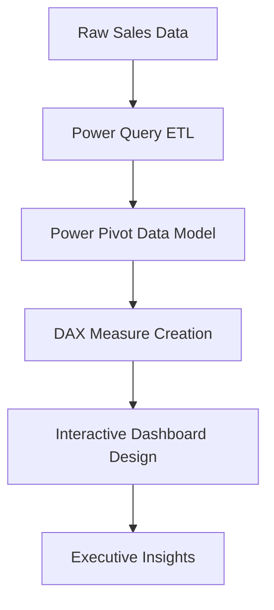

# 📊 Multi-Year Sales Performance Dashboard

  

  
  
  
  

---

## 📈 Executive Metrics

  
  
  

---

## 📌 Project Overview
This project presents a **multi-year sales performance analysis dashboard** built entirely using **Microsoft Excel** with advanced BI techniques. The solution transforms raw sales data into a structured analytical model and delivers a fully interactive executive dashboard.

### 📐 Analytical Workflow

---

## 🛠️ Technical Implementation

<b>1. Data Preparation (ETL)</b>

 
<ul>
  <li><b>Tool:</b> Power Query.</li>
  <li>Standardized transactional records across multiple spreadsheets.</li>
  <li>Cleaned geographic discrepancies (State/City normalization).</li>
  <li>Handled outliers and missing profit values.</li>
</ul>

<b>2. Star Schema Data Modeling</b>

 
<ul>
  <li><b>Tool:</b> Power Pivot.</li>
  <li>Built relationships between Fact and Dimension tables.</li>
  <li>Dimension Tables: `Calendar`, `Geography`, `Products`, `Customers`.</li>
  <li>Optimized for fast slicing and dicing across massive datasets.</li>
</ul>

---

## 📊 Business Insights
*   **🌍 Regional Dominance:** The **Western region** leads in total sales volume, but profit margins vary significantly by product category.
*   **📦 Logistics Impact:** **Standard Class shipping** accounts for 60% of the volume, suggesting a price-sensitive customer base.
*   **🏆 Customer Value:** The top 10 customers contribute disproportionately to the bottom line, indicating a strong Pareto effect.

---

## 👤 Author
**Mohamed Salah Abdelhamid**
*   LinkedIn: [mohamedsalah-abdelhamid](https://www.linkedin.com/in/mohamedsalah-abdelhamid/)
*   GitHub: [@mohamedsalahabdelhamid](https://github.com/mohamedsalahabdelhamid)

---

  Built with ❤️ by Mohamed Salah

